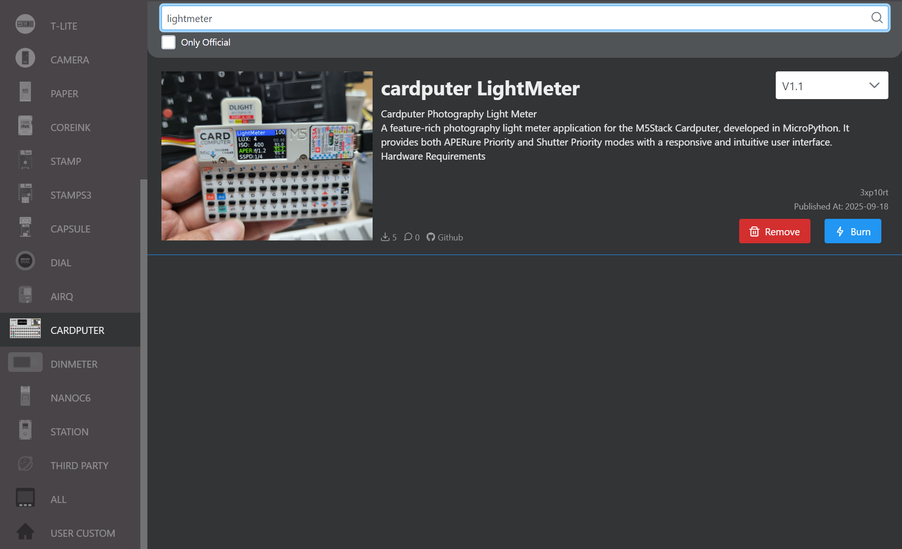

# Cardputer Photography Light Meter

[English](#english) | [中文](#中文)

---

<a name="english"></a>

## 📷 Cardputer Photography Light Meter (English)

A feature-rich photography light meter application for the M5Stack Cardputer, developed in MicroPython. It provides both APERure Priority and Shutter Priority modes with a responsive and intuitive user interface.

 
 
<!-- TODO: Replace this with your own app screenshot -->

### Hardware Requirements

*   M5Stack Cardputer
*   M5Stack DLight Unit (I2C Ambient Light Sensor)

### Features

-   **Dual-Mode Metering**: Supports APERure Priority (`A`) and Shutter Priority (`S`) modes to suit different shooting scenarios.
-   **Real-Time Calculation**: After adjusting any exposure parameter (ISO, APERure, Shutter), the third parameter is calculated and updated instantly without any confirmation needed.
-   **Intuitive UI**:
    *   The left side clearly displays the final exposure combination of ISO, APERure (`APER`), and Shutter Speed (`SSPD`).
    *   The right side features a vertical selection list for the currently adjustable parameter, providing clear context.
    *   The currently focused parameter and the selected value in the list are highlighted in **green** for clear operational focus.
-   **Smart Boundary Detection**:
    *   When an option in the selection list would cause the calculated result to exceed the preset range (e.g., a shutter Speed faster than 1/4000s), that option is marked in **red**.
    *   The application **prevents** the user from selecting red-marked invalid options, ensuring operations stay within a valid exposure range.
-   **Non-Circular Selection**: The parameter list stops scrolling when it reaches the maximum or minimum value, which is more precise and aligns with professional habits.
-   **Hardware Info**: Displays the real-time LUX value from the DLight sensor and the device's battery level.

### How to Use

#### Key Controls

-   **`Tab` key**: Cycles the operational focus between ISO, APERure (`APER`), and Shutter Speed (`SSPD`).
-   **`i` / `a` / `s` keys**: Directly switch operational focus and metering mode.
    -   **`a` key**: Sets to **APERure Priority** mode and moves focus to APERure (`APER`).
    -   **`s` key**: Sets to **Shutter Priority** mode and moves focus to Shutter Speed (`SSPD`).
    -   **`i` key**: Moves focus to ISO. This action **does not** change the current metering mode (A/S).
-   **`.` key (Up Arrow)**: Scrolls up and selects a value for the focused parameter.
-   **`;` key (Down Arrow)**: Scrolls down and selects a value for the focused parameter.

### Installation

#### Method 1: Using UIFlow2.0

This project is developed for deployment using **UIFlow2.0**.

1.  **Burn Firmware**: First, use **M5Burner** to burn the latest UIFlow2.0 firmware onto your Cardputer.(I recommend flashing the[M5Launcher Cardputer](https://github.com/bmorcelli/Launcher)firmware and then installing UIFlow2.bin from the SD card. This way, your Cardputer can still run other firmwares)
2.  **Connect Device**: Press and hold the **G0** button while connecting your Cardputer to your computer via a USB-C cable to enter download mode.
3.  **Open UIFlow2.0**: Launch the UIFlow2.0 IDE (either the web version at [uiflow2.m5stack.com](https://uiflow2.m5stack.com/)).
4.  **Select Device**: In the IDE, select "Cardputer" as your device and establish a connection via the correct COM port.
5.  **Load Project**:
    *   Download the `cardputer_LightMeter.m5f2` project file from this repository to your computer.
    *   In the UIFlow2.0 IDE, click on the "Open..." menu option (the folder icon).
    *   Select the downloaded `cardputer_LightMeter.m5f2` file to import the entire project.
6.  **Deploy**: Click the **Download the program to device** button to automatically download and execute the program on your Cardputer.


#### Method 2: Using M5Burner (.bin firmware)

I have added the compiled .bin firmware and uploaded it to M5Burner. You can now download and burn this firmware using M5Burner. However, it doesn't run correctly when loaded with M5Launcher, and I haven't found the reason yet.



#### Method 3: Build from Source (How to compile UIFlow2.0 code into a .bin firmware)

1.  Clone `uiflow-micropython` after configuring the ESP-IDF environment.
    ```bash
    git clone --depth 1 --branch v5.4.1 https://github.com/espressif/esp-idf.git
    git -C esp-idf submodule update --init --recursive
    ./esp-idf/install.sh
    . ./esp-idf/export.sh
    git clone https://github.com/m5stack/uiflow_micropython
    cd uiflow_micropython/m5stack
    # Initialize and update git submodules (dependencies like esp-idf)
    make submodules
    # Apply M5Stack's custom patches
    make patch
    # Compile the tool for creating the littlefs filesystem image
    make littlefs
    # Compile the MicroPython cross-compiler to convert .py to .mpy
    make mpy-cross
    ```
2.  Replace `uiflow_micropython/m5stack/fs/user/main.py` with `main.py` from this project.
3.  Modify `uiflow_micropython/m5stack/fs/user/boot.py`:
    Change:
    ```python
    try:
            boot_option = nvs.get_u8("boot_option")
        except:
            boot_option = 1  # default
    ```
    to:
    ```python
    boot_option = 0
    ```
4.  Go back to the `uiflow_micropython/m5stack` directory and compile:
    ```bash
    make BOARD=M5STACK_Cardputer pack_all
    ```
    You will get a firmware file like `uiflow_micropython/m5stack/build-M5STACK_Cardputer/uiflow-a0699092-esp32s3-8mb-cardputer-v2.3.5-20250924.bin`.

### Acknowledgements

Special thanks to Gemini Code Assist for helping me solve coding challenges. My primary role in this project was to define the requirements and perform testing. Gemini Code Assist proved to be an excellent coding partner, especially when the software requirements and the methods for verifying them were clearly defined.
---

<a name="中文"></a>

## 📷 Cardputer 摄影测光表 (中文)

这是一款为 M5Stack Cardputer 打造的功能完善的摄影测光表应用，使用 MicroPython 开发。它提供了光圈优先和快门优先两种核心测光模式，并拥有一个响应迅速、交互直观的用户界面。


### 硬件需求

*   M5Stack Cardputer
*   M5Stack DLight Unit (I2C 环境光传感器)

### 功能特性

-   **双模式测光**: 支持光圈优先 (`A`) 和快门优先 (`S`) 模式，满足不同拍摄场景的需求。
-   **实时计算**: 调整任何曝光参数（ISO、光圈、快门）后，程序会立即计算出第三个参数的值，无需等待或确认。
-   **直观的用户界面**:
    *   左侧清晰显示 ISO、光圈 (`APER`) 和快门速度 (`SSPD`) 的最终曝光组合。
    *   右侧为当前可调参数的纵向选择列表，提供清晰的上下文。
    *   当前拥有输入焦点的参数和在列表中选中的值，均以**绿色**高亮显示，操作目标明确。
-   **智能边界检测**:
    *   当待选列表中的某个选项会导致计算结果超出预设范围时（例如，计算出的快门速度快于 1/4000s），该选项会在列表中被标为**红色**。
    *   程序会**阻止**用户选择被标为红色的无效选项，确保操作始终在有效曝光组合内。
-   **非循环选择**: 参数列表在选择到最大或最小值后会停止滚动，操作更精确、更符合专业习惯。
-   **硬件信息显示**: 实时显示 DLight 传感器读取的 LUX 值和设备电量。

### 如何使用

#### 按键控制

-   **`Tab` 键**: 在 ISO、光圈 (`APER`) 和快门速度 (`SSPD`) 之间循环切换操作焦点。
-   **`i` / `a` / `s` 键**: 直接切换操作焦点和测光模式。
    -   **`a` 键**: 设定为 **光圈优先** 模式，并将操作焦点切换到光圈 (`APER`)。
    -   **`s` 键**: 设定为 **快门优先** 模式，并将操作焦点切换到快门速度 (`SSPD`)。
    -   **`i` 键**: 将操作焦点切换到 ISO。此操作**不会**改变当前的测光模式（光圈/快门优先）。
-   **`.` 键 (上箭头)**: 向上滚动并选择当前焦点参数的值。
-   **`;` 键 (下箭头)**: 向下滚动并选择当前焦点参数的值。

### 安装与部署

#### 方法一：使用 UIFlow2.0

本项目使用 **UIFlow2.0** 进行开发和部署。

1.  **烧录固件**: 首先，使用 **M5Burner** 工具为您的 Cardputer 烧录最新的 UIFlow2.0 固件。（我推荐烧录[M5Launcher Cardputer](https://github.com/bmorcelli/Launcher)固件，再从SD卡安装UIFlow2.bin，这样您的cardputer就仍然能运行其他固件）
2.  **连接设备**: 按住 **G0** 键的同时，使用 USB-C 数据线将您的 Cardputer 连接到电脑，使其进入下载模式。
3.  **打开 UIFlow2.0**: 启动 UIFlow2.0 IDE (可以是网页版 [uiflow2.m5stack.com](https://uiflow2.m5stack.com/))。
4.  **选择设备**: 在 IDE 中，选择 "Cardputer" 作为您的设备，并通过正确的 COM 端口建立连接。
5.  **加载项目**:
    *   从本代码库下载 `cardputer_LightMeter.m5f2` 项目文件到您的电脑。
    *   在 UIFlow2.0 IDE 中，点击“打开...”菜单选项（文件夹图标）。
    *   选择已下载的 `cardputer_LightMeter.m5f2` 文件以导入整个项目。
6.  **部署**: 点击 **下载到设备** 按钮，程序将会自动下载并到您的 Cardputer 上执行。


#### 方法二：使用 M5Burner（.bin 固件）

我添加了编译的.bin固件，已经上传到M5bunner，现在可以通过M5bunner下载和烧录这个固件了。但是使用M5launcher加载运行不正常，我还没找到原因。


#### 方法三：从源码编译（如何将UIFlow2.0的代码编译成.bin固件）

1.  配置ESP-IDF环境后克隆uiflow-micropython
    ```bash
    git clone --depth 1 --branch v5.4.1 https://github.com/espressif/esp-idf.git
    git -C esp-idf submodule update --init --recursive
    ./esp-idf/install.sh
    . ./esp-idf/export.sh
    git clone https://github.com/m5stack/uiflow_micropython
    cd uiflow_micropython/m5stack
    # 初始化并更新git子模块（如esp-idf等依赖项）
    make submodules
    # 应用M5Stack的自定义补丁
    make patch
    # 编译用于创建littlefs文件系统镜像的工具
    make littlefs
    # 编译MicroPython交叉编译器，用于将.py文件转换为.mpy文件
    make mpy-cross
    ```
2.  将`uiflow_micropython/m5stack/fs/user/main.py`替换成本项目的`main.py`
3.  更改`uiflow_micropython/m5stack/fs/user/boot.py`
    将
    ```python
    try:
            boot_option = nvs.get_u8("boot_option")
        except:
            boot_option = 1  # default
    ```
    改成
    ```python
    boot_option = 0
    ```
4.  回到`uiflow_micropython/m5stack`目录执行编译
    ```bash
    make BOARD=M5STACK_Cardputer pack_all
    ```
    最终得到类似`uiflow_micropython/m5stack/build-M5STACK_Cardputer/uiflow-a0699092-esp32s3-8mb-cardputer-v2.3.5-20250924.bin`的固件。

### 致谢

感谢Gemini Code Assist帮我解决代码问题，我参与的工作主要是提出需求和进行测试。当你明确知道软件需求以及如何验证这些需求是否得以很好的实现时，Gemini Code Assist是一个很棒的编码帮手。
